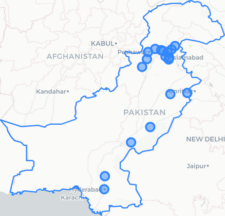
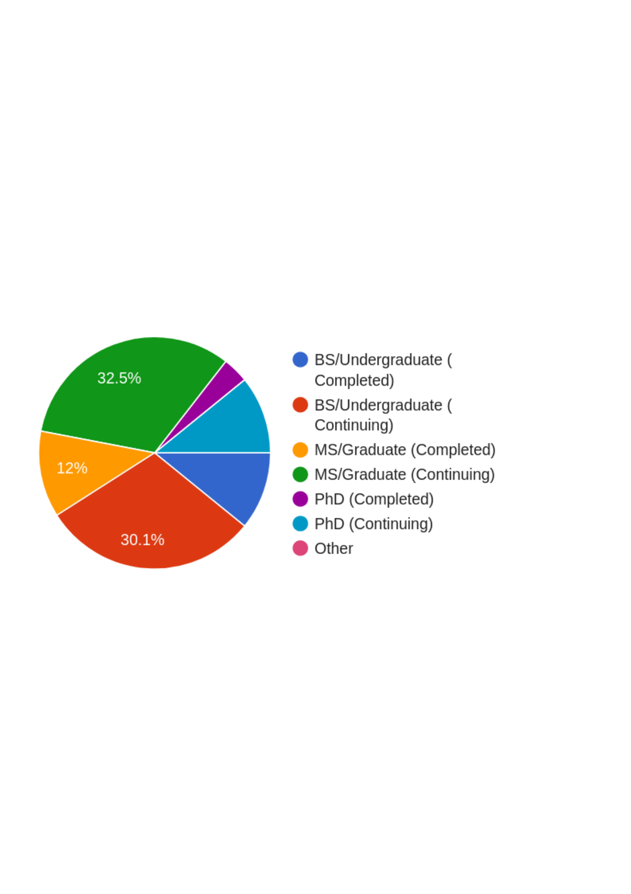
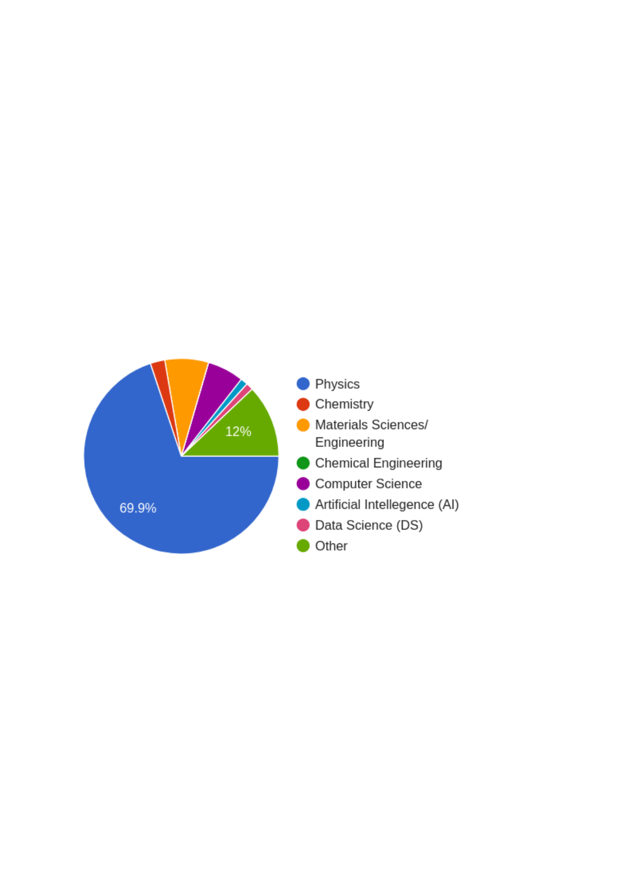

# Executive Summary

Quantum Meets AI 2026 was conceived as an interdisciplinary workshop at the intersection of quantum mechanics, computational materials science, and artificial intelligence. While its primary objective was educational, the event also served as a valuable case study of Pakistan's emerging computational science ecosystem.

Three observations emerged.

1. Demand for high-quality technical training significantly exceeded supply.
2. Students from diverse disciplines demonstrated strong interest in computational materials science and scientific AI.
3. The principal bottleneck is no longer talent, but access to computational infrastructure, software, and sustained training.

These findings suggest that investments in scientific computing infrastructure would benefit not only computational materials science, but also artificial intelligence, computational chemistry, engineering, and other computational disciplines.

# Introduction

Recent advances in artificial intelligence and computational materials science are transforming how new materials are discovered. These developments rely upon a common foundation of scientific computing: high-performance computing (HPC), numerical methods, simulation software, and machine learning.

Despite growing global interest, structured training opportunities in these areas remain scarce in Pakistan. Quantum Meets AI 2026 was organized to introduce students to modern computational methods while simultaneously assessing national demand for interdisciplinary training.

Although not designed as a formal survey, the registration process, participant demographics, and post-event feedback collectively provide useful evidence regarding the current state of Pakistan's computational science ecosystem.

# Evidence from Registration

## Demand Exceeded Capacity

Registration opened on **June 10** and all available seats were filled by **June 20**, despite an official registration deadline of **June 25**.

The rapid filling of available seats indicates substantial unmet demand for advanced technical workshops in computational science.

Future workshops should therefore prioritize increasing capacity rather than simply repeating existing formats.

## Geographic Distribution

:::: {.columns}

::: {.column width="60%"}

Participants represented institutions across much of Pakistan.

Most registrations originated from the corridor stretching from **Peshawar to Lahore**, although participants also traveled from **Karachi**, **Jamshoro**, **Nawabshah**, and several smaller cities.

The geographic diversity suggests that interest is not confined to a few research-intensive universities.

:::

::: {.column width="40%"}

<!-- Pakistan participant map -->

:::

::::

## Financial Accessibility

:::: {.columns}

::: {.column width="45%"}

A substantial number of registration fee waivers were awarded.

Nevertheless, many participants chose to pay the full registration fee despite the availability of financial assistance.

This suggests that students perceive high value in intensive technical training and are willing to invest personal resources when opportunities are available.

:::

::: {.column width="55%"}

<!-- Waiver figure -->
(To be updated upon receipt fo final figures)
:::

::::

## Academic Level

:::: {.columns}

::: {.column width="60%"}

The majority of participants were at the master's level or beyond.

This reflects strong early-career interest in computational science and suggests that interventions at this stage may have the greatest long-term impact.

:::

::: {.column width="40%"}

<!-- Education plot -->

:::

::::

## Gender Diversity

:::: {.columns}

::: {.column width="45%"}

Women constituted the majority of registered participants.

Although the workshop was not designed as a study of gender participation, this observation indicates that interdisciplinary computational science can attract broad participation when barriers to entry are minimized.

Further investigation is warranted to understand the factors contributing to this outcome.

:::

::: {.column width="55%"}

<!-- Gender plot -->

:::

::::

## Academic Diversity

:::: {.columns}

::: {.column width="45%"}

Registrations represented a wide range of disciplines, including

- Physics
- Chemistry
- Materials Science
- Computer Science
- Artificial Intelligence
- Data Science

This diversity reflects the increasingly interdisciplinary nature of modern computational research.

:::

::: {.column width="55%"}

<!-- Discipline plot -->

:::

::::

# Lessons from the Workshop

Will be added post-event.

<!-- ## Highly Motivated Participants -->

<!-- Participant engagement remained consistently high throughout the workshop.

Questions frequently extended beyond scheduled sessions, and many attendees requested additional learning resources, indicating sustained interest rather than passive participation. -->

<!-- ## Gaps in Computational Training -->

<!-- Participants entered with highly variable computational backgrounds.

Many possessed basic programming experience but had limited exposure to

- Linux
- High-performance computing
- Scientific software
- Parallel computing
- Workflow automation

These gaps significantly increase the learning curve for computational research. -->

<!-- ## Interdisciplinary Education Remains Challenging -->

<!-- Students from physics backgrounds adapted quickly to simulation software but often lacked machine learning experience.

Conversely, students trained in artificial intelligence frequently lacked sufficient knowledge of quantum mechanics and computational physics.

Future educational programs should intentionally integrate these domains rather than treating them as independent subjects. -->

# Lessons After the Workshop

Will be added post-event.
<!-- ## Infrastructure is the Primary Bottleneck

The strongest conclusion emerging from the workshop is that Pakistan possesses motivated students but insufficient computational infrastructure.

Interest is abundant.

Access is limited.

Scientific computing requires infrastructure beyond consumer GPUs, including

- HPC clusters
- High-memory compute nodes
- Fast interconnects
- Scientific software licenses
- Long-term storage
- Technical support

## Scientific Computing and AI are Complementary

The computational infrastructure required for computational materials science substantially overlaps with that required for artificial intelligence.

Investments in scientific computing therefore strengthen multiple research communities simultaneously.

Rather than viewing AI and computational science as competing priorities, policymakers should recognize them as mutually reinforcing components of a national computational ecosystem.

## Community Building Matters

One unexpected outcome of the workshop was the formation of an interdisciplinary community.

Participants from traditionally separate disciplines discovered common computational challenges and expressed strong interest in continued collaboration.

Sustaining such communities may be as important as delivering technical content. -->

# Policy Recommendations

Will be added post-event.
<!-- ## Recommendation 1

Establish regional high-performance computing centers that are accessible to universities nationwide.

## Recommendation 2

Support recurring national schools in computational materials science and scientific AI.

## Recommendation 3

Develop open educational resources, including lecture videos, notebooks, datasets, and practical tutorials.

## Recommendation 4

Create competitive grants enabling universities to establish computational science laboratories.

## Recommendation 5

Promote interdisciplinary curricula integrating

- Quantum mechanics
- Computational materials science
- Machine learning
- High-performance computing
- Scientific programming

## Recommendation 6

Support long-term research communities through workshops, online forums, and collaborative research initiatives. -->

# Conclusion

<!-- Quantum Meets AI 2026 demonstrates that Pakistan possesses a substantial pool of motivated students eager to engage with modern computational science.

The principal constraint is no longer interest or talent but sustained access to computational infrastructure, software, and advanced technical training.

Strategic investments in scientific computing would not only strengthen computational materials science but also enhance national capabilities in artificial intelligence, computational chemistry, engineering simulation, climate modeling, and many other computational disciplines.

The workshop therefore serves not merely as an educational success, but as evidence that Pakistan is ready to build a stronger national computational science ecosystem. -->